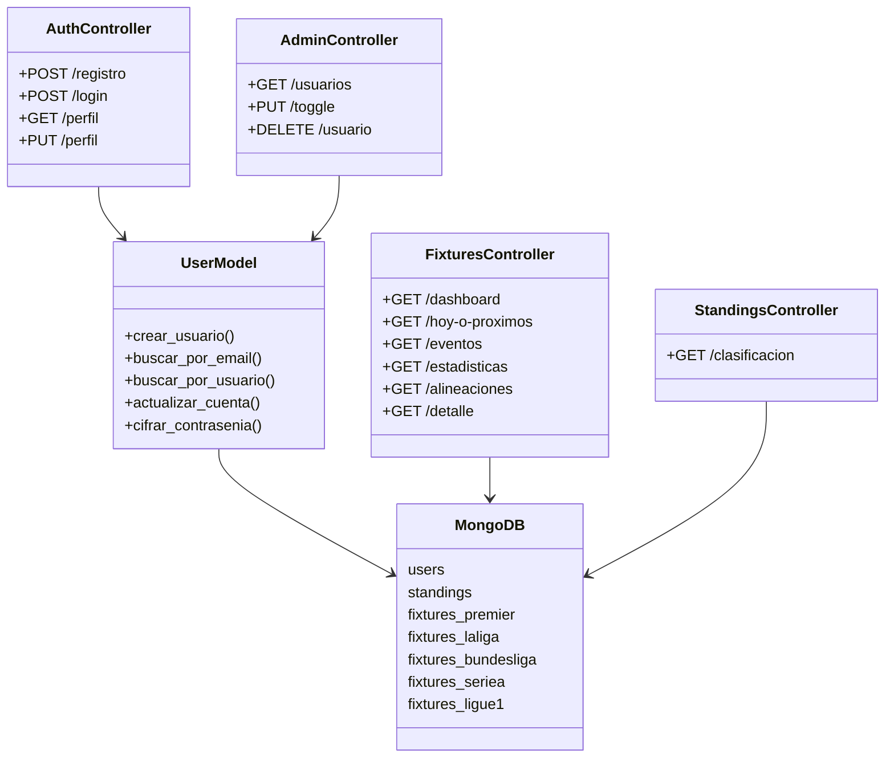

# Diagrama de Clases - BeinScore

```mermaid
classDiagram
    class AuthController {
        +POST /registro
        +POST /login
        +GET /perfil
        +PUT /perfil
    }
    class AdminController {
        +GET /usuarios
        +PUT /toggle
        +DELETE /usuario
    }
    class FixturesController {
        +GET /dashboard
        +GET /hoy-o-proximos
        +GET /eventos
        +GET /estadisticas
        +GET /alineaciones
        +GET /detalle
    }
    class StandingsController {
        +GET /clasificacion
    }
    class UserModel {
        +crear_usuario()
        +buscar_por_email()
        +buscar_por_usuario()
        +actualizar_cuenta()
        +cifrar_contrasenia()
    }
    class MongoDB {
        users
        standings
        fixtures_premier
        fixtures_laliga
        fixtures_bundesliga
        fixtures_seriea
        fixtures_ligue1
    }

    AuthController --> UserModel
    AdminController --> UserModel
    UserModel --> MongoDB
    FixturesController --> MongoDB
    StandingsController --> MongoDB
```
